# Performance Signature with Dynatrace (AppMon) for Jenkins
[](https://ci.jenkins.io/job/Plugins/job/performance-signature-dynatrace-plugin/job/master/)
[](https://sonarcloud.io/dashboard?id=de.tsystems.mms.apm%3Aperformance-signature-parent-pom)

Latest software products are created with the help of flexible and agile systems in a continuous integration (CI) environment. Such environments include a CI-Server like Jenkins.
 The Performance Signature collects performance values during a build and evaluates and compares the result with previous builds and non-functional requirements.
 Several software tests can be run and evaluated automatically, so that the most important key performance indicators (KPI) can be summarized and be available for all project participants very quickly.

### Get in touch with Application Performance Experts


**T-Systems Multimedia Solutions GmbH**

Send a [mail](performance@t-systems-mms.com) to the Application Performance Team

---
## Introduction

The Performance Signature evaluates aggregated load and performance data from Dynatrace (AppMon) after each build.
We are supporting currently three data sources:
* Dynatrace AppMon
* Dynatrace SaaS/Manged
* Remote Jenkins Jobs with enabled Performance Signature

Each data source has it's own Jenkins plugin, but all Jenkins plugins depend on the Performance Signature: UI Plugin.
Find below the documentation of each component.
### Table of Contents

<!-- toc -->

- [Performance Signature: Dynatrace AppMon](#performance-signature-dynatrace-appmon)
  * [1. Application overview](#1-application-overview)
    + [1.1 Short description, aims and tasks](#11-short-description-aims-and-tasks)
  * [2. Functional description of the Plugin](#2-functional-description-of-the-plugin)
  * [3. Installation](#3-installation)
    + [3.1 Code repositories](#31-code-repositories)
      - [3.1.1 Jenkins Plugin](#311-jenkins-plugin)
      - [3.1.2 Dynatrace Fastpack](#312-dynatrace-fastpack)
    + [3.2 Requirements](#32-requirements)
      - [3.2.1 Dynatrace user permissions](#321-dynatrace-user-permissions)
      - [3.2.2 Port activation](#322-port-activation)
    + [3.3 Plugin installation](#33-plugin-installation)
    + [3.4 Plugin updates inside the CI-Server](#34-plugin-updates-inside-the-ci-server)
  * [4 Plugin Configuration](#4-plugin-configuration)
    + [4.1 Configure Dynatrace server](#41-configure-dynatrace-server)
    + [4.2 Build step job configuration](#42-build-step-job-configuration)
    + [4.3 Post build step job configuration](#43-post-build-step-job-configuration)
      - [4.3.1 Configuration of unit tests](#431-configuration-of-unit-tests)
      - [4.3.2 Configuration of generic test cases](#432-configuration-of-generic-test-cases)
    + [4.4 Configuration of Pipeline steps](#44-configuration-of-pipeline-steps)
    + [4.5 Advanced settings](#45-advanced-settings)
  * [5 Customizing the Performance Signature Overview](#5-customizing-the-performance-signature-overview)
    + [5.1 Access enhanced JUnit tests](#51-access-enhanced-junit-tests)
  * [6 Content of reports](#6-content-of-reports)
    + [6.1 Content of PDF reports](#61-content-of-pdf-reports)
      - [6.1.1 Single reports](#611-single-reports)
      - [6.1.2 Comparison reports](#612-comparison-reports)
    + [6.2 XML reports](#62-xml-reports)
- [Performance Signature: Dynatrace SaaS/Managed](#performance-signature-dynatrace-saasmanaged)
- [Performance Signature: Dynatrace Viewer](#performance-signature-dynatrace-viewer)
- [Problems? Questions? Suggestions?](#problems-questions-suggestions)
- [Additional Resources](#additional-resources)
  * [Dynatrace AppMon Documentation](#dynatrace-appmon-documentation)
  * [Dynatrace SaaS/Managed Documentation](#dynatrace-saasmanaged-documentation)
  * [Links](#links)

<!-- tocstop -->

## Performance Signature: Dynatrace AppMon

### 1. Application overview
This chapter includes all required information to get a brief overview about the available features and the requirements to run the application.

#### 1.1 Short description, aims and tasks
The Performance Signature evaluates aggregated load and performance data after each build. This solution is implemented as a plugin for the performance analysis and monitoring tool Dynatrace.
The Performance Signature basically consists of the following components:
* Dynatrace system (Server, Collector, Agents, Performance Warehouse)
* Jenkins with installed Performance Signature plugin

The following tasks are performed by the plugin:
* automated Dynatrace session recording
* automated Test Runs 
* summary and visualization of important measured values
* providing Dynatrace Performance reports

The goal is to be able to quickly analyse and compare the KPIs for each build.

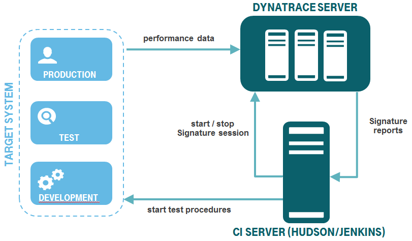

***Figure 1:*** *schematic sytem overview*

### 2. Functional description of the Plugin
The workflow of the Performance Signature is as follows:

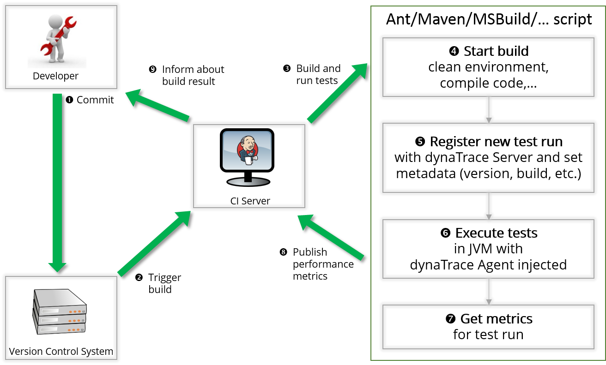

***Figure 2:*** *Performance Signature workflow ([source](https://community.dynatrace.com/community/display/DOCDT63/Integrate+Dynatrace+in+Continuous+Integration+Builds))*

1. A new software release gets committed
2. The build job gets triggered
3. The build job is starting
4. Code compilation and deployment to target system
5. Register new test case in Dynatrace and start Dynatrace session recording
6. Test execution in JVM with deployed application and injected Dynatrace agents
7. Stop Dynatrace session recording and start metric evaluation and report generation in Dynatrace
8. Publication of metrics and reports to the CI-Server
9. Display of test results

The plugin is the main component of the Performance Signature.

After configuration, the plugin collects the performance data from the Dynatrace server during each build process. The following figure shows the console output generated by the plugin:

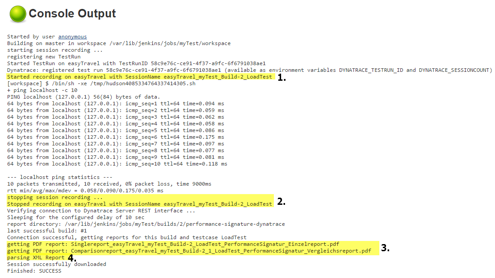

***Figure 3:*** *sample console output of the plugin*

1. First a Dynatrace session with the following naming convention will be started:
`<Profile>_<CI-Server project name>_Build-<build number>_<type of test>`
In the above example, the following session name is configured: `easyTravel_myTest_Build-2_LoadTest`
After starting the session the actual load / performance or unit test is carried out. In the above example, a dummy test was used.
2. In the next step the Dynatrace session will be stopped. After a pre-configured time, necessary so that the Dynatrace Server can provide proper data, the post-build action will be started.
3. Following this, the reports of individual test cases are generated and stored in the Jenkins workspace directory. For comparison reports this directory is located at:   
    `{PATH_TO_CI-Server}/jobs/{JOBNAME}/{BUILDNUMBER}/performance-signature`    
    URL (example): `https://{ CI-Server }/job/{JOBNAME}/2/performance-signature/getComparisonReport?testCase=LoadTest&number=0`
    
    Comparison reports are generated each time there is at least one successful previous build. This previous build will be compared with the current build.

    The single reports on the current build are stored in the same directory:       
    `{PATH_TO_ CI-Server}/jobs/{JOBNAME}/{BUILDNUMBER}/performance-signature`    
    URL (example): `https://{ CI-Server }/job/{JOBNAME}/16/performance-signature /getSingleReport?testCase=LoadTest&number=0`

    It’s possible that this directory does not contain any PDF reports. This scenario occurs only when there is no connection to the Dynatrace Server or a fatal error occurred during a build. To always obtain a PDF report the alias lastStableBuild should be used instead of the build number in the URL.
    The naming convention of the PDF reports remains the same as the session naming convention:     
    For single reports:     
    `Singlereport_<profile>_< CI-Server project name>_Build-<build number>_<type of test>.pdf`  
    For comparison reports:     
    `Comparisonreport_<profile>_< CI-Server project name >_Build-<build number>_ <comparison build number>_<type of test>.pdf`
4. Finally, XML data from Dynatrace dashboards will be collected and analysed.

The performance data is displayed using the web interface of the CI-Server:


***Figure 4:*** *job overview*

The figure above shows an example job overview. On the right side of the job overview, the configured measures of the individual builds and test cases are shown.
To access the overview page of the Performance Signature, the marked links can be used or just click on the Performance Signature link on the right side. The overview contains all comparison reports and also the measured values of the individual builds.

 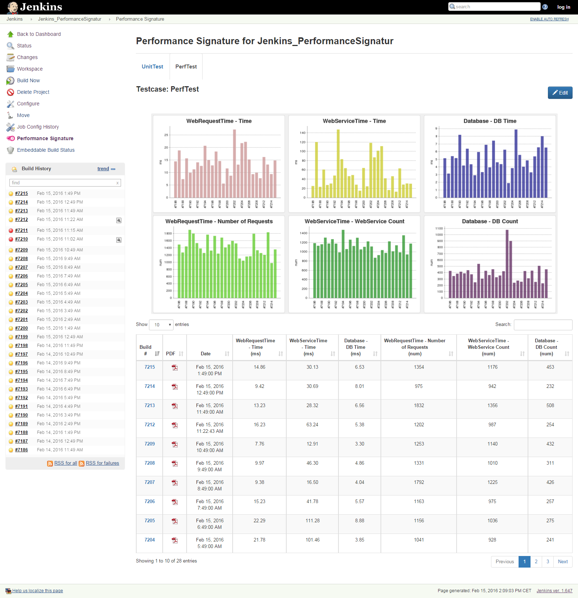
***Figure 5:*** *Performance Signature overview*

### 3. Installation
This chapter includes a step by step documentation of the installation procedure. Only the Performance Signature plugin is required and should be manually installed on the Jenkins server. The plugin file (.hpi) is provided by T-Systems Multimedia Solutions GmbH and can be accessed via the CI servers update center.

#### 3.1 Code repositories
##### 3.1.1 Jenkins Plugin
Source code: https://github.com/T-Systems-MMS/perfsig-jenkins    
Releases:    	
https://updates.jenkins-ci.org/download/plugins/performance-signature-dynatrace/    
https://updates.jenkins-ci.org/download/plugins/performance-signature-ui/   
https://updates.jenkins-ci.org/download/plugins/performance-signature-viewer/

##### 3.1.2	Dynatrace Fastpack
Source code: https://github.com/T-Systems-MMS/perfsig-fastpack  
Releases: https://github.com/T-Systems-MMS/perfsig-fastpack/releases

#### 3.2 Requirements 
In order to install and run the Performance Signature the following requirements have to be met:
*	CI-Server Jenkins  (>= 2.60.3) with the following plugins:
     * Credentials Plugin (>=2.1.17)
     * JUnit Plugin (>=1.20)
     * Structs Plugin (>=1.14)
     * Static Analysis Utilities (>=1.50)
     * Pipeline: Step API (>=2.13)
*	Dynatrace >= 7.0 (PredProd / Prod Licence)
     * appropriate Dynatrace profile incl. proper configuration
     * Dynatrace user with REST access privileges (see 4.2.1)
     * provided Dynatrace FastPack (including Dynatrace sample dashboards) installed

##### 3.2.1 Dynatrace user permissions
The plugin uses the REST interface to communicate with the Dynatrace server. A user must be created on the Dynatrace server with the following privileges, to get all information from provided sample dashboards: 

* Analyse Business Transactions
* Analyse Database Hotspots
* Analyse Database Performance
* Analyse Exceptions
* Analyse Incidents
* Analyse Response Time Hotspots
* Analyse WebRequest Performance
* Analyse WebService Performance
* Export Stored Sessions to a local directory
* Generate Dashboard Reports via Web Service
* Re-Analyse Stored Session
* Read Stored Sessions
* Show Measure data within Charts
* Start or Stop Session Recording
* Store Live System Session
* Web Service Interface Access
* Agent Hot Sensor Placement (if necessary)
* Change Active System Configuration (if necessary)
* Create Memory Dumps (if necessary)
* Create Thread Dumps (if necessary)
* Manage Incidents (if necessary)
* Read permissions for provided dashboards from installed Dynatrace Fastpack or any of your own preferred dashboards

##### 3.2.2 Port activation
The Performance Signature plugin enables the CI Server to communicate with the Dynatrace Server. The CI Server uses the Dynatrace Server REST interface, triggering activities for collecting performance data. For the communication the REST interface port between the CI Server and Dynatrace Server needs to be opened.    
The default ports are:
* 8020 for HTTP
* 8021 for HTTPS (recommended)

These ports can be customized in the Dynatrace server configuration.

#### 3.3 Plugin installation
This subchapter describes the install routine for the official Performance Signature plugin.
1.	Open the „Manage <Jenkins/Hudson“ section inside the CI-Server’s web interface
2.	Open the „Plugin Manager” and select the „Available“ tab
3.	Search for “performance signature”
4.	Activate the checkbox “Performance Signature with Dynatrace” and click the button “Install now” to install the plugin
5.	The plugin is installed automatically. The configuration of the plugin has to be applied inside the build job configuration.

#### 3.4 Plugin updates inside the CI-Server
The update of the plugin is done just like the installation of the plugin. The update requires a restart of the CI-Server.

### 4 Plugin Configuration
The plugin configuration has to be applied inside the build job of the CI-Server as post build action and contains the configuration of the performance / unit test. The global configuration holds the configuration for connecting the Dynatrace server.

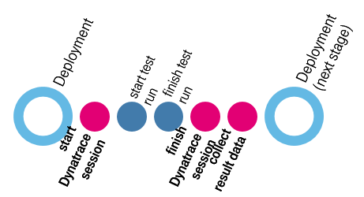

***Figure 6:*** *example workflow*

#### 4.1 Configure Dynatrace server
The Dynatrace Server configuration has to be applied in the global configuration of the CI-Server:  
navigate to Manage Jenkins/Hudson >> Configure System or use this url to add a Dynatrace Server:    
`https://{ CI-Server }:8080/configure`

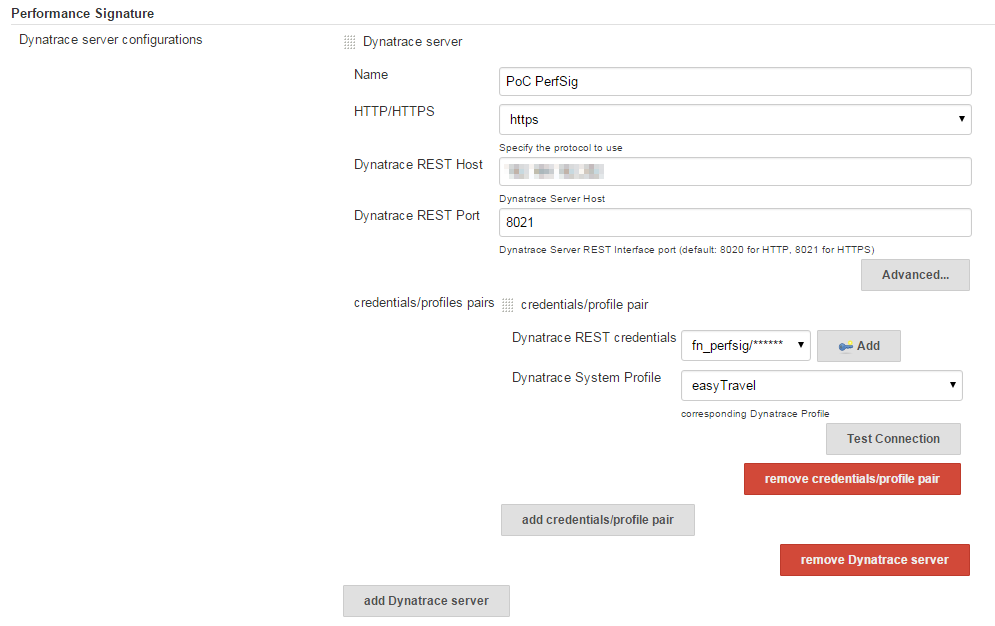
 
***Figure 7:*** *global Dynatrace server configuration*

In the configuration section “advanced” a delay can be adjusted, which controls the time before querying dashboards and other REST data from the Dynatrace Server, in case the server itself is under heavy load.
If the Jenkins server cannot reach the Dynatrace server without a proxy, it’s possible to use the configured proxy in Jenkins (Settings  Plugin Manager  Advanced) or to specify an own proxy server with setting “Use custom proxy server”.

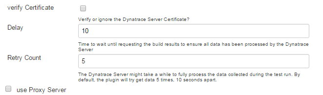

***Figure 8:*** *Dynatrace server advanced settings*

#### 4.2 Build step job configuration
This configuration assigns test case(s) to build steps for collection of performance data. For each test type (performance test, unit test or other) the following build steps have to be added in the section “Build Procedure”:

1. Start Dynatrace Session Recording
2. Add a Test Step with a unique name.
3. Stop Dynatrace Session Recording

It is possible to add several test cases to a single build job. The test in step 2 can be performed by custom build steps, e.g. via shell script, batch, Ant or Maven.

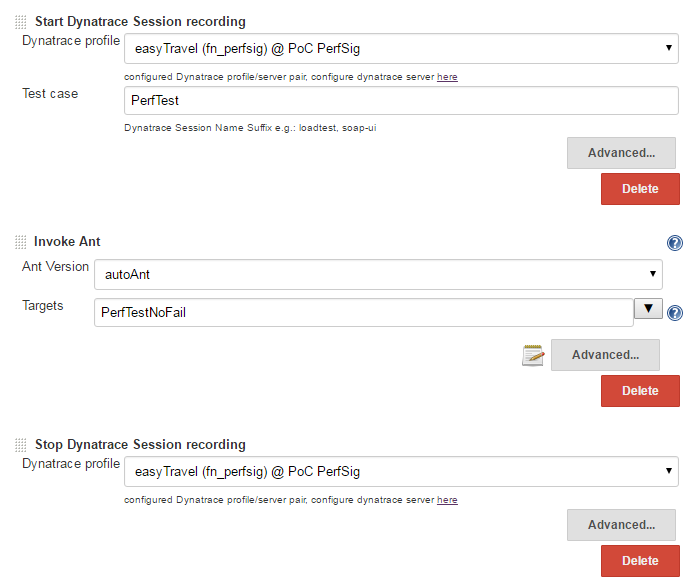

***Figure 9:*** *build steps*

#### 4.3 Post build step job configuration 
The Post build job evaluates the collected performance data and publishes customizable Performance Signature Reports. For the evaluation of the collected performance data and the publication of reports requires a Dynatrace user is needed. The Dynatrace user needs read permission on the dashboards used for report generation (section 4.2.1).   
In the section “Post Build Actions” you have to configure the following parameters:
	
1. Add `publish Performance Signature Reports` to Post-Build steps
2. Configure the test cases and assign the Dynatrace Report Dashboards

Ensure to assign the test case names used in in the “Build Procedure“ section. With “Add Test Case” several test cases can be configured. There are two test case types: generic test case and unit test case.

##### 4.3.1 Configuration of unit tests
This configuration step is needed to map Dynatrace dashboards with previously defined test cases and collected unit test performance data for report creation. The unit test case type is using Dynatrace test automation interfaces to gather unit test specific performance data. Choose one of the previously configured test case names (see build step start session recording &rightarrow; Test Case Name) from the dropdown list. 

The basis for report generation is Dynatrace dashboards. Single and comparison reports will be exported as PDF. Every dashlet element in XML dashboards will be included in the Performance Signature overview. The client dashboard can be opened by following the “open in Dynatrace client” link in the detail view.

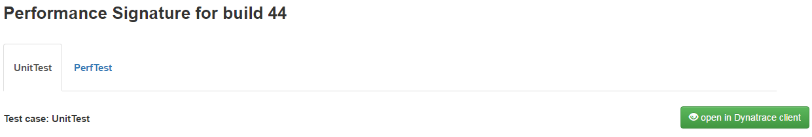

***Figure 10:*** *Dynatrace client link*

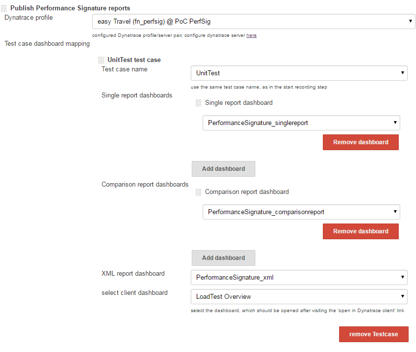
***Figure 11:*** *unit test case configuration*

For the following it is important to understand that a test run represents the execution of several test cases.

Technically the Performance Signature Plugin performs the following activities for each test run: 
* Before the session recording is triggered and the test case is started the plugin creates a new test run on the Dynatrace Server. The REST interface supplies a unique testRunId. The unique testRunId identifies the test run within Dynatrace.
* The Plugin additionally tags Dynatrace Session recording of the Test run with Jenkins/Hudson BUILD ID, Purpose: correlation of test results, DT performance data to a software build. Tagging the test runs with the BUILD_ID enables that the results of multiple test runs (executing different test cases) can be mapped to a single software build and summarize the results into a single report.
* A Dynatrace agent is required to enable the tagging of unit tests. The tagging meta information is passed to Dynatrace Agent. The Dynatrace Agent needs to be injected in the process which executes the unit test. 
* Below is an example of injecting the agent with tagging meta information into an Ant build job. Ensure that the environment variables are imported.

```xml
<property environment="env"/>
<condition property="build.number" value="${env.BUILD_ID}">
<isset property="env.BUILD_ID" />
</condition>
<junit printsummary="on"
	errorproperty="test.error"
	failureproperty="test.failure"
	timeout="60000"
	showoutput="on"
	outputtoformatters="on"
	fork="on"
	tempdir="${user.home}/.dynaTrace/easyTravel 2.0.0/easyTravel/tmp">
<jvmarg value="${dtagent},optionTestRunIdJava=${env.DYNATRACE_TESTRUN_ID}"/>
```
***Figure 12:*** *unit test case configuration*

For more information about the integration of Dynatrace into major build tools see the official Dynatrace documentation: 
https://community.dynatrace.com/community/display/DOCDT62/Integrate+Dynatrace+in+Continuous+Integration+Builds

For the evaluation of unit test run results an additional post-build step „Publish JUnit Test Results’ is required and needs to be configured. Further information about the JUnit plugin: https://wiki.jenkins-ci.org/display/JENKINS/JUnit+Plugin

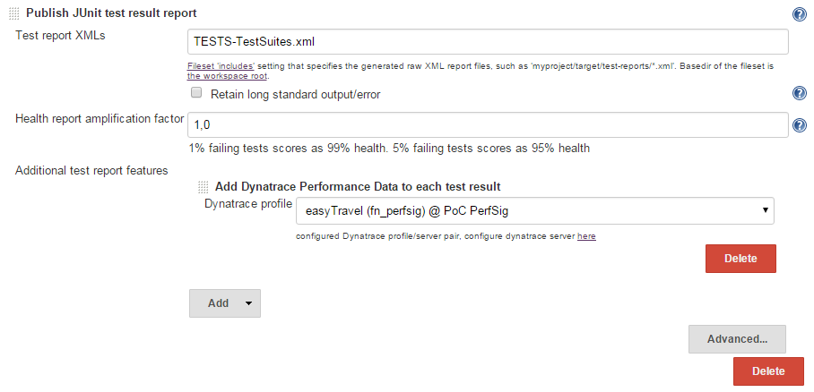

***Figure 13:*** *configuration of the JUnit plugin*

##### 4.3.2 Configuration of generic test cases
Generic test cases allow collecting performance data and generating reports of other test types than unit tests such as performance tests.  
The configuration of generic test follows the principles as used in unit test (see section 5.3.1). As with unit tests choose one of the previously configured test case names (see build step start session recording &rightarrow; Test Case Name) from the dropdown list.

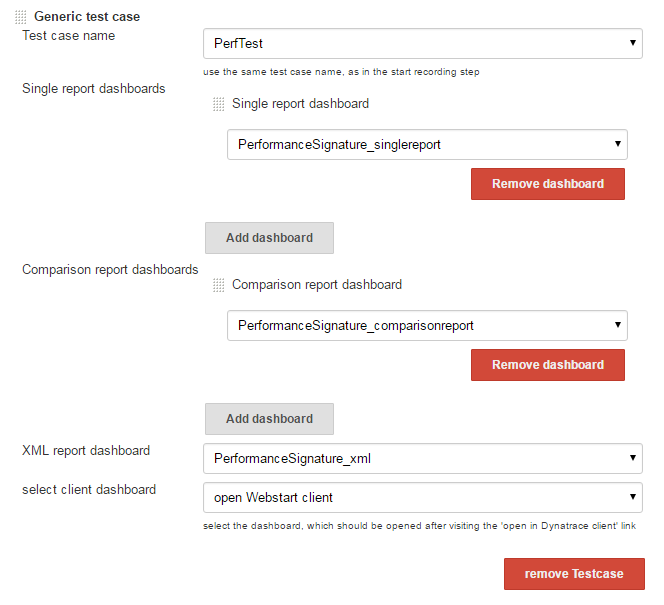

***Figure 14:*** *generic test case configuration*

#### 4.4 Configuration of Pipeline steps
As of version 2.0 the plugin is compatible to the Jenkins Pipeline API. All build steps described above are available in the Pipeline Snippet Generator (`https://{CI-Server}:8080/job/{Pipeline job}/pipeline-syntax/)`

Start session example:

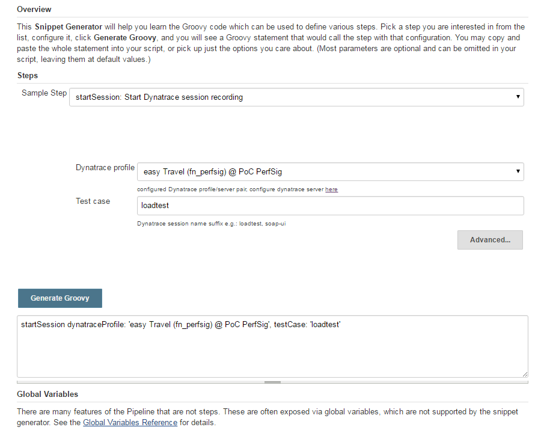

Figure 15:  snippet generator example

Please recognize the right order of the Performance Signature builds steps described in chapter 2.

Following example can be used to replace a Freestyle job:
```groovy
node {
    stage('StartSessionRecording') {
        startSession dynatraceProfile: 'easy Travel (fn_perfsig) @ PoC PerfSig', testCase: 'workflowTest'
    }
    stage('Loadtest') {
        sh './startLoadtest.sh'
    }
    stage('StopSessionRecording') {
        stopSession 'easy Travel (fn_perfsig) @ PoC PerfSig'
    }
    stage('getReports') {
        perfSigReports configurationTestCases: [[$class: 'GenericTestCase', clientDashboard: 'open Webstart client', comparisonDashboards: [[dashboard: 'PerformanceSignature_comparisonreport']], name: 'workflowTest', singleDashboards: [[dashboard: 'PerformanceSignature_singlereport']], xmlDashboard: 'PerformanceSignature_xml']], dynatraceProfile: 'easy Travel (fn_perfsig) @ PoC PerfSig', exportSessions: true
    }
}
```
***Figure 16:*** *pipeline job example code*

#### 4.5 Advanced settings
The configuration section “advanced” allows configuring automated session export and the modification of the built result status.

If the session export option is activated the plugin automatically downloads the recorded Dynatrace sessions to the report directory (described in chapter 3) of the CI Server. Thus the Dynatrace session, the test results and the generated reports are stored in one place for each build.

The Performance Signature Plugin is capable of modifying the built result depending on the results of executed tests. In case of occurring Dynatrace incidents (e.g. CPU unhealthy) in Dynatrace session recorded during test run execution the build result can be modified according to the 5 available options. In case the build result should be modified “Incident rules” need to be setup in Dynatrace.

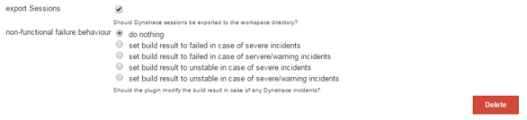

***Figure 15:*** *advanced settings*

### 5 Customizing the Performance Signature Overview
The Performance Signature overview page can be customized depending on the test case. It can be configured which measures from the corresponding Dynatrace dashboard are shown on the performance Signature overview page. Using the edit button, it’s possible to select the measures to be displayed from all existing measures. The aggregation of a measure, the chart title (custom measure name) and the number of comparison values from previous builds for a measure (custom build counts) can be adjusted.
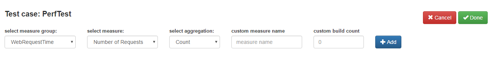
***Figure 16:*** *selection of measures*

After deleting and adding the desired charts, the configuration will be saved by clicking the “Done” button. The table below the charts shows only the data of the previously configured charts.

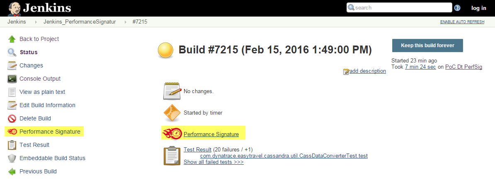

***Figure 17:*** *overview of a sample Jenkins build*

To access the individual reports and charts of a build, follow the highlighted links. In this view (Figure 17), detailed measure data of the current build and the last successful build can be accessed and single reports and sessions can be downloaded.

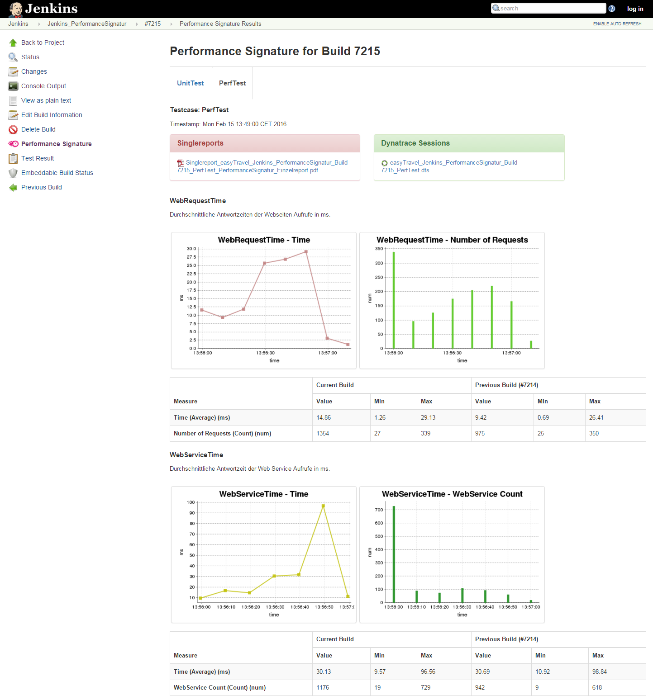

***Figure 18:*** *view of an individual build*

#### 5.1 Access enhanced JUnit tests
To view the enhanced JUnit test reports in Jenkins it’s necessary that all steps were executed from section 5.3.1.


***Figure 19:*** *job overview with junit test data*

To view the JUnit test reports, follow the highlighted links in the job overview:

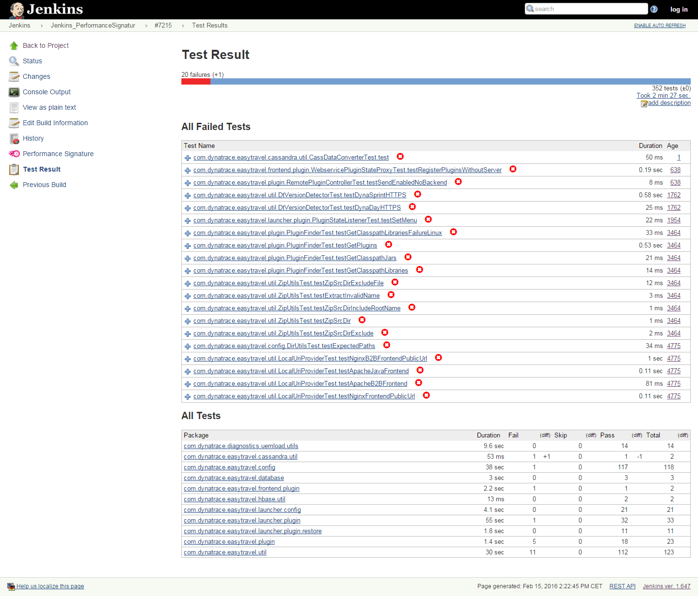
***Figure 20:*** *JUnit test report for an individual build*

In this view the Dynatrace test automation data can be accessed by clicking on the different status icons behind the JUnit test method: 

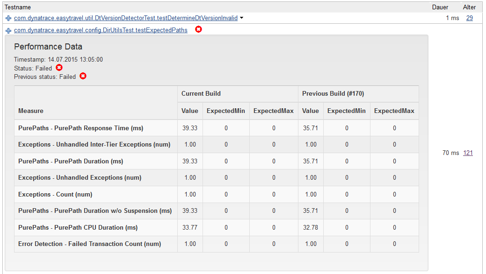

***Figure 21:*** *detailed test automation data for one Junit test*

These measures are also available by clicking on the test method in the JUnit test report:


***Figure 22:*** *detailed view of a Junit test*

### 6 Content of reports
This section describes the content of the reports included in the fastpack. Keep in mind that the content of the reports can be customized according to the test, use case or application. All measures are preinstalled in a Dynatrace system profile except Database INSERT, UPDATA, DELETE, SELECT execution time and Count.

#### 6.1 Content of PDF reports
##### 6.1.1 Single reports
The single reports are generated for each build and test case and contain the most important characteristics and metrics by default:
* Overview over important non-functional requirements
* Web requests (only the 20 highest average execution times)
* Web Service methods (only the 20 highest average execution times)
* Database measures (min/max/avg.) for INSERT / UPDATE / DELETE / SELECT statements
* HTTP errors and exceptions of the application

##### 6.1.2 Comparison reports
If there is at least one successful previous build, comparison reports are generated for each following build. These reports contain the following measures by default:
* Web Page requests (only the 20 highest average execution times)
* Web Service methods (only the 20 highest average execution times)
* HTTP errors and exceptions of the application
* Database measures (response time hotspots, execution hotspots, pool usage)

#### 6.2 XML reports
The XML reports are required to visualize the various measures of the individual builds in Jenkins in charts. The dashboard contains the following values by default:
* Synthetic Web Requests + Count
* Web Request Time + Count
* Web Service Time + Count
* Database Time + Count
* GC Utilization
* CPU Load
* Database Preparation Count
* Failed Transaction Count

## Performance Signature: Dynatrace SaaS/Managed

## Performance Signature: Dynatrace Viewer

## Problems? Questions? Suggestions?

* [Jenkins Plugin FAQ / Troubleshooting Guide](FAQ.md)
* Post any problems, questions or suggestions to the Dynatrace Community's [Application Monitoring & UEM Forum](https://answers.dynatrace.com/spaces/146/index.html).
* Mail us at `performance@t-systems-mms.com`

## Additional Resources

### Dynatrace AppMon Documentation

- [Continuous Delivery & Test Automation](https://community.dynatrace.com/community/pages/viewpage.action?pageId=215161284)
- [Capture Performance Data from Tests](https://community.dynatrace.com/community/display/DOCDT63/Capture+Performance+Data+from+Tests)
- [Integrate Dynatrace in Continuous Integration Builds](https://community.dynatrace.com/community/display/DOCDT63/Integrate+Dynatrace+in+Continuous+Integration+Builds)

### Dynatrace SaaS/Managed Documentation

- https://www.dynatrace.com/support/doc/nam/

### Links

* [Dynatrace Plugin Page](https://community.dynatrace.com/community/display/DL/Performance+Signature+Plugin)
* [Open issues](https://issues.jenkins-ci.org/issues/?jql=project%20%3D%20JENKINS%20AND%20status%20in%20(Open%2C%20%22In%20Progress%22%2C%20Reopened)%20AND%20component%20%3D%20%27performance-signature-dynatrace-plugin%27)
* [Changelog](CHANGELOG.md)
