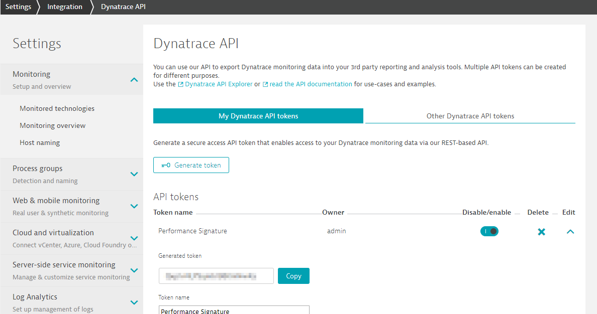
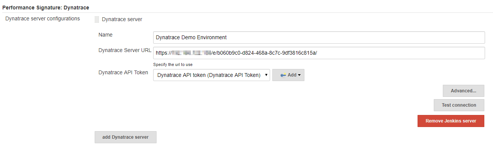

## Performance Signature: Dynatrace SaaS/Managed

### Installation
#### Using Jenkins Update Center 

The recommended way of installing the plugin is by the Update Center (plugin directory). Navigate to `Manage Jenkins -> Manage Plugins` page and switch to the `Available` tab. Search for the "Dynatrace" keyword and install the plugin.

#### Manual Installation

This procedure is meant for developers who want to install locally built plugin version.

* build the plugin from source using `mvn package` command
* in Jenkins, go to `Manage Jenkins -> Manage Plugins` page
* switch to the `Advanced` tab
* upload the built plugin package from `target/performance-signature-dynatracesaas.hpi` path in the `Upload Plugin` section
* restart Jenkins when the installation is complete

### Configuration
#### Global settings

A Dynatrace API Token is needed for access to the Dynatrace API REST Interface. To create a Dynatrace API Token go to `Settings -> Integration -> Dynatrace API` in your Environment and generate a Token with the following access scopes:
* Access problem and event feed, metrics, topology and RUM JavaScript tag management
* User session query language

The global settings for the plugin are located under `Manage Jenkins -> Configure System -> Dynatrace Application Monitoring`. The connection to the Dynatrace Server is configured in this section. 

The advanced section enables you to set a delay before retrieving the test results from the server. Change this settings if you are not getting all the test results in Jenkins.

#### Build configuration

In the build configuration (`<Project> -> Configure`), first enable *Use Dynatrace AppMon to monitor tests* in the `Build Environment` tab and fill the required fields.

You can then choose one of two options to register Test Run:
* [Option 1](build-config-testrun-jenkins.md), when:
    * you want an easy integration and don't want to adapt your build scripts too much
    * you are OK with defining the version in Jenkins to register the Test Run
* [Option 2](build-config-testrun-maven-ant-gradle.md), when:
    * you don't mind using an additional plug-in in your Ant/Maven scripts
    * you want to re-use the Ant/Maven version to register the Test Run

#### Post Build Action

At the end of the build, add the Dynatrace AppMon **post-build action** to retrieve the test results. You can also decide if the test results will change the build status.

### Examples

